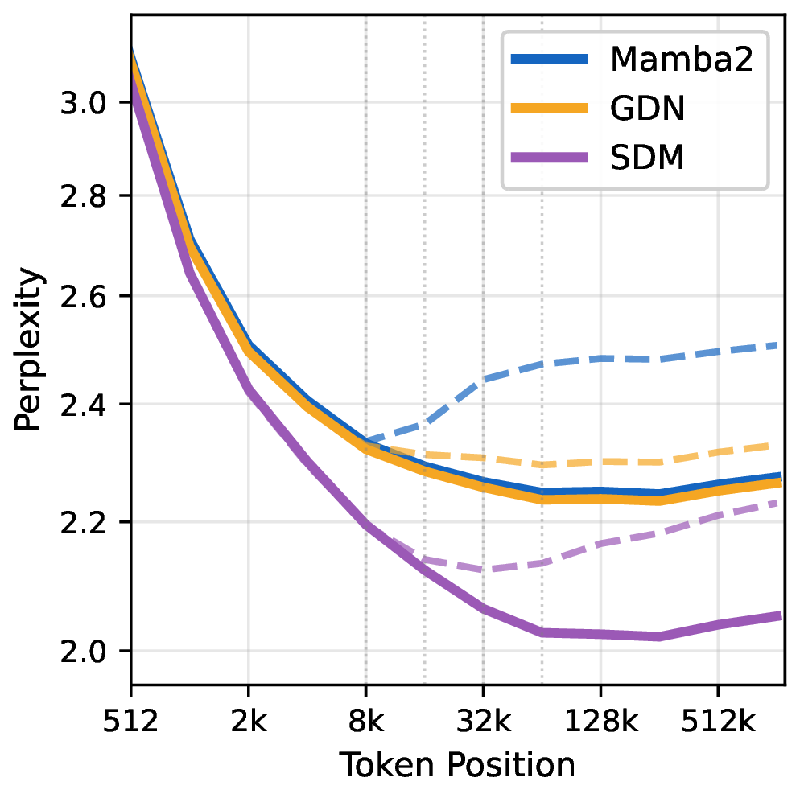
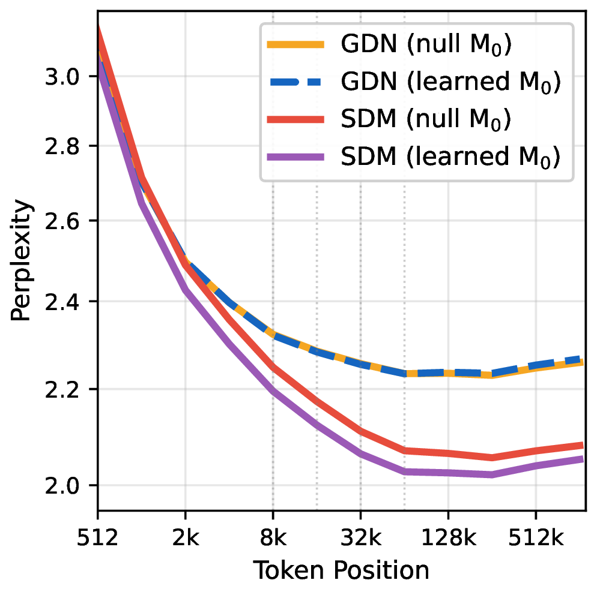

# Sparse-Delta-Memory (SDM)

<!-- markdownlint-disable html -->
<div align="center" style="line-height: 1;">
  <a href="https://lcabannes.github.io/sdm-blogpost" target="_blank" style="margin: 2px;">
    
  </a>
  <a href="https://arxiv.org/abs/2607.07386" target="_blank" style="margin: 2px;">
    
  </a>
  <a href="https://github.com/facebookresearch/sparse-delta-memory" target="_blank" style="margin: 2px;">
    
  </a>
  <a href="LICENSE" style="margin: 2px;">
    
  </a>
</div>
<hr>

Reference implementation of **Sparse-Delta-Memory** — a sparse memory bank with
deltanet-style gating (the *Gated Memory Controller* from the paper). SDM is a
sequence mixer that reads from and writes to a large sparse memory via product
keys, with gated (forget/input) delta-rule updates.

This repository is a fork of [Meta Lingua](https://github.com/facebookresearch/lingua);
the SDM-specific code lives under `lingua/sparse_delta_memory/`. For everything
else (data prep, training/eval scaffolding, `stool`), refer to the
[Meta Lingua README](https://github.com/facebookresearch/lingua).

## Results

Results from the paper. All models use sliding-window attention (SWA) as the local layer
and vary the **global** layer; SDM and GDN are matched in FLOPs and (non-memory) parameters.

### Perplexity by token position (code, 1M-token documents)

<p align="center">
  
  &nbsp;&nbsp;
  
</p>

**Left (Fig. 4):** perplexity by token position on code data (1.4B; solid = 128k long-context
finetuned, dashed = pre-trained). SDM reaches lower perplexity than Mamba2/GDN — already at
short context (a benefit of the learned initial state) and increasingly at long context.
**Right (Fig. 5):** learned-initial-state ($\mathbf{M_0}$) ablation — learning $\mathbf{M_0}$
helps SDM but not GDN.

### Long-context retrieval (RULER)

Exact-match accuracy, averaged over sequence lengths 4k–131k. **Δ = SDM − GDN** (iso-FLOP);
$\color{green}{\textsf{green}}$ = SDM better, $\color{red}{\textsf{red}}$ = worse.

**1.4B (L08)**

| RULER task | FullAttn | Mamba2 | GDN | SDM | Δ (SDM−GDN) |
|---|--:|--:|--:|--:|--:|
| single_1 | 64.2 | 53.8 | 99.9 | 100.0 | $\color{green}{+0.1}$ |
| single_2 | 53.1 | 19.2 | 20.7 | 70.8 | $\color{green}{+50.1}$ |
| single_3 | 41.1 | 8.0 | 12.1 | 46.3 | $\color{green}{+34.2}$ |
| multikey_1 | 44.0 | 14.7 | 13.6 | 35.0 | $\color{green}{+21.4}$ |
| multikey_2 | 25.3 | 1.0 | 0.7 | 0.8 | $\color{green}{+0.1}$ |
| multikey_3 | 8.6 | 0.2 | 0.1 | 0.2 | $\color{green}{+0.1}$ |
| multivalue | 39.8 | 17.5 | 11.7 | 37.4 | $\color{green}{+25.7}$ |
| multiquery | 39.0 | 10.5 | 11.8 | 41.1 | $\color{green}{+29.3}$ |
| vt | 32.1 | 8.6 | 16.6 | 23.7 | $\color{green}{+7.1}$ |
| cwe | 5.8 | 3.6 | 6.6 | 8.7 | $\color{green}{+2.1}$ |
| fwe | 30.9 | 37.5 | 35.6 | 12.3 | $\color{red}{-23.2}$ |
| qa_1 | 19.3 | 11.5 | 13.3 | 13.3 | $\color{green}{+0.0}$ |
| qa_2 | 20.9 | 18.5 | 18.3 | 18.0 | $\color{red}{-0.3}$ |
| **Average** | 32.5 | 17.9 | 20.0 | **31.2** | $\color{green}{\mathbf{+11.2}}$ |

**8B (L13)**

| RULER task | FullAttn | GDN | SDM | Δ (SDM−GDN) |
|---|--:|--:|--:|--:|
| single_1 | 99.3 | 100.0 | 100.0 | $\color{green}{+0.0}$ |
| single_2 | 89.4 | 45.1 | 71.5 | $\color{green}{+26.4}$ |
| single_3 | 70.1 | 32.6 | 74.9 | $\color{green}{+42.3}$ |
| multikey_1 | 75.3 | 32.9 | 59.3 | $\color{green}{+26.4}$ |
| multikey_2 | 58.0 | 1.0 | 4.7 | $\color{green}{+3.7}$ |
| multikey_3 | 29.8 | 0.1 | 1.2 | $\color{green}{+1.1}$ |
| multivalue | 74.3 | 31.1 | 66.1 | $\color{green}{+35.0}$ |
| multiquery | 73.0 | 31.2 | 68.6 | $\color{green}{+37.4}$ |
| vt | 67.2 | 46.2 | 72.3 | $\color{green}{+26.1}$ |
| cwe | 5.5 | 11.4 | 12.8 | $\color{green}{+1.5}$ |
| fwe | 77.8 | 62.7 | 65.0 | $\color{green}{+2.4}$ |
| qa_1 | 39.0 | 23.6 | 27.2 | $\color{green}{+3.6}$ |
| qa_2 | 38.4 | 28.2 | 30.4 | $\color{green}{+2.3}$ |
| **Average** | 61.2 | 34.2 | **50.2** | $\color{green}{\mathbf{+16.0}}$ |

## Quick start

```bash
git clone https://github.com/facebookresearch/sparse-delta-memory
cd sparse-delta-memory

# Create the environment (SLURM optional). Installs torch, triton, einops, ninja.
# Tip: if /tmp is small (often a tiny tmpfs), point scratch at a roomy disk first — the
# torch wheel + JIT kernel builds need a couple GB:  export TMPDIR=$HOME/tmp; mkdir -p $TMPDIR
bash setup/create_env.sh          # or: sbatch setup/create_env.sh
conda activate lingua_<date>
```

**Fastest check — no data, no downloads, no distributed.** Exercises the CUDA/Triton kernels
(they JIT-compile on first use, ~90 s) with a forward+backward across all flag configs:

```bash
PYTHONPATH=. python tests/smoke_sdm.py
# full test suite (self-contained; pytest optional): pip install -r requirements-dev.txt && pytest tests/
```

**Smallest "does it train" run — still zero downloads.** The `bytes` tokenizer needs no vocab
file, so a few synthetic JSONL chunks are enough:

```bash
mkdir -p data/shuffled/dclm_baseline_1.0
python - <<'PY'
import json, random
random.seed(0); w = "the quick brown fox sparse delta memory attention window".split()
with open("data/shuffled/dclm_baseline_1.0/dclm_baseline_1.0.chunk.00.jsonl", "w") as f:
    for _ in range(4000):
        f.write(json.dumps({"text": " ".join(random.choice(w) for _ in range(random.randint(40, 120)))}) + "\n")
PY

# Single GPU. debug_sdm.yaml uses FSDP, which does an NCCL init collective even on 1 GPU —
# on a node with no/mismatched NIC naming, force loopback:
NCCL_SOCKET_IFNAME=lo NCCL_IB_DISABLE=1 NCCL_P2P_DISABLE=1 \
  torchrun --nproc-per-node 1 -m apps.main.train config=apps/main/configs/debug_sdm.yaml \
  dump_dir=/tmp/sdm_debug data.root_dir=data/shuffled
```
> On a real filesystem, not tmpfs — DCP checkpoint saving fails on tmpfs `dump_dir`.

For real training, download data + a tokenizer (see the Meta Lingua README for options):

```bash
python setup/download_prepare_hf_data.py fineweb_edu <MEMORY> --data_dir ./data --seed 42
python setup/download_tokenizer.py llama3 <SAVE_PATH> --api_key <HF_TOKEN>
```

The provided configs are **templates** — set `dump_dir`, `data.root_dir`, and
`data.tokenizer.path` before launching.

```bash
# Multi-GPU locally  (add the NCCL_* vars above if your node lacks a routable NIC)
torchrun --nproc-per-node 8 -m apps.main.train config=apps/main/configs/sdm_flagship.yaml

# SLURM
python -m lingua.stool script=apps.main.train config=apps/main/configs/sdm_flagship.yaml nodes=8 partition=<partition>
```

> **CUDA kernels:** the SDM kernels JIT-compile on first use via
> `torch.utils.cpp_extension.load_inline` (cached in `TORCH_EXTENSIONS_DIR`).
> This requires **torch ≥ 2.8 (triton ≥ 3.4)** — the kernels use bf16 `atomic_add`,
> which triton 3.3 (torch 2.7) does not support — plus a CUDA toolkit (`nvcc`) and a
> host `g++` at runtime, and an **SM 80+ GPU** (Ampere/Hopper) for the async gather and
> bf16 atomics. On SLURM, point `TORCH_EXTENSIONS_DIR` (and `TMPDIR`) at a node-local
> writable path to avoid cross-rank build races and small-`/tmp` failures.

## Project overview

```
lingua/sparse_delta_memory/
 ┣ layer.py         # SparseDeltaMemory (the layer) + SparseDeltaMemoryArgs
 ┣ memory_ops.py    # Triton kernels: sparse inner product, product-key top-k, fused decay/scatter, WY phase-2
 ┣ triton_argsort.py
 ┣ cache.py         # inference/decode state
 ┗ cuda/            # CUDA kernels (JIT via load_inline): sparse_ip, warp_cooperative_gather, ...
```

Every layer is assigned an explicit type via three lists in the model config —
`attn_at` (full attention), `swa_at` (sliding-window attention), and `sdm_at` (SDM) —
each either `"all"` or a list of layer indices, together covering all `n_layers` exactly
once. SWA and full attention are distinct layer types with independent head configs
(`swa_n_heads` / `swa_n_kv_heads` / `swa_head_dim`, `swa_window`). The SDM memory size is
configured **per head** via `sdm_args.slots_per_head` (bank `= num_heads * slots_per_head`
slots, learned when `backprop_on_memory=true`).

Wiring into the base library is minimal: `lingua/transformer.py` (per-layer
mixer selection), `lingua/optim.py` (no-weight-decay on the gating parameters),
and `apps/main/transformer.py` (tensor-parallel skips SDM layers).

See `lingua/sparse_delta_memory/README.md` and `SNAPSHOT_QUANT.md` for kernel
design notes.

## Configuration

Example configs under `apps/main/configs/`. Each SDM config pairs with an iso-backbone
attention baseline (SWA local layers; SDM vs. full attention in the global slot):

| Config | What |
|---|---|
| `debug_sdm.yaml` | small, single-GPU smoke run |
| `debug_hybrid.yaml` | small 3-way SWA + attn + SDM hybrid |
| `sdm_flagship.yaml` | 1.4B, 3:1 SWA:SDM hybrid |
| `baseline_1.4B.yaml` | 1.4B A/B control (SWA + full attention) |
| `sdm_7B.yaml` | 7B, 3:1 SWA:SDM hybrid |
| `baseline_7B.yaml` | 7B A/B control (SWA + full attention) |

## Acknowledgements

SDM combines two prior ideas — sparse product-key memory and the gated delta rule.

**Original ideas (papers):**
- Product-key memory — [*Large Memory Layers with Product Keys*](https://arxiv.org/abs/1907.05242) (Lample et al., 2019)
- Gated delta rule — [*Gated Delta Networks: Improving Mamba2 with Delta Rule*](https://arxiv.org/abs/2412.06464) (Yang et al., 2025)

**Implementations we referred to (code):**
- [Memory Layers at Scale](https://github.com/facebookresearch/memory) — for the product-key memory
- [flash-linear-attention (FLA)](https://github.com/fla-org/flash-linear-attention) — for the gated delta-rule update (whose `A`/`dt` initialization we match)

This repository is a fork of [Meta Lingua](https://github.com/facebookresearch/lingua)
(BSD-3-Clause); refer to its README for the general training/eval workflow.

## Citation

```bibtex
@misc{sparse_delta_memory,
  author = {Lo{\"i}c Cabannes and Pierre-Emmanuel Mazar{\'e} and Gergely Szilvasy and Matthijs Douze and Maria Lomeli and Ilze Amanda Auzina and Justin Carpentier and Gabriel Synnaeve and Herv{\'e} J{\'e}gou},
  title  = {{Sparse Delta Memory: Scaling the State of Linear RNNs through Sparsity}},
  year   = {2026},
  eprint = {2607.07386},
  archivePrefix = {arXiv},
  primaryClass = {cs.LG},
  url    = {https://arxiv.org/abs/2607.07386}
}
```

## License

Sparse-Delta-Memory is licensed under **CC-BY-NC 4.0** — see the `LICENSE` file.
This code is derived from Meta Lingua, which is BSD-3-Clause licensed.
